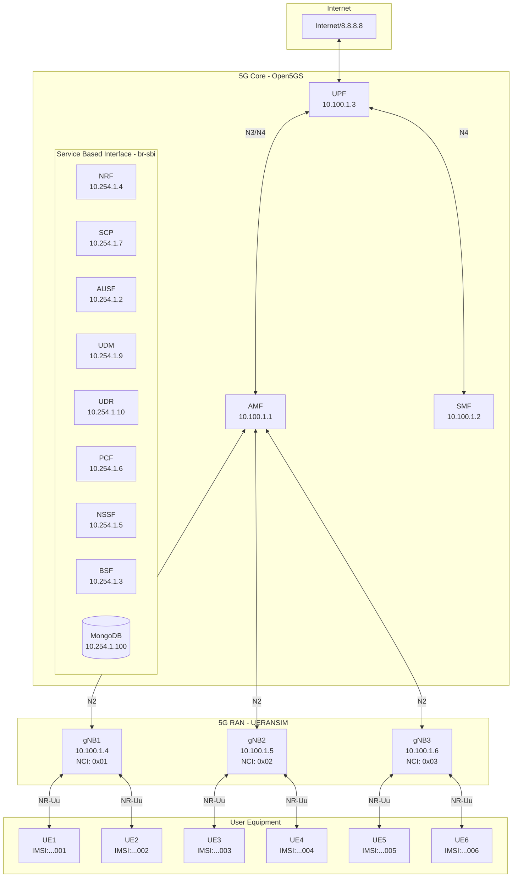
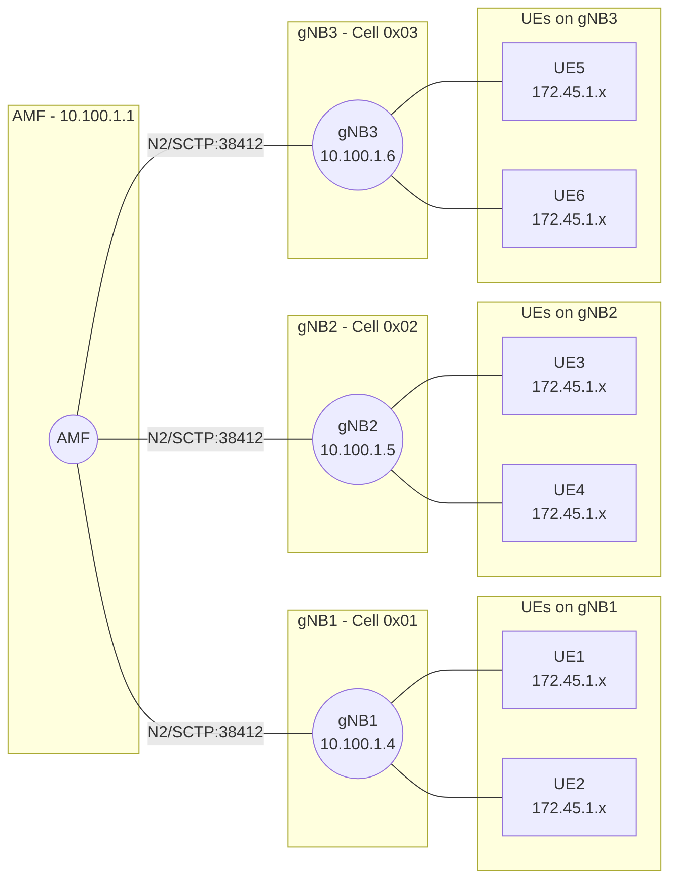
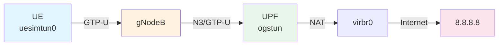
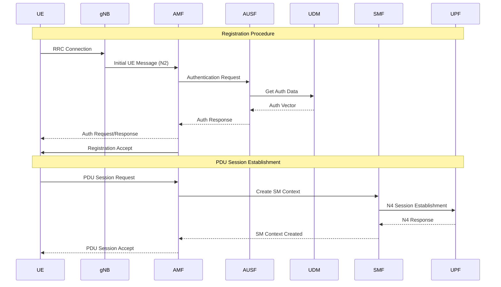
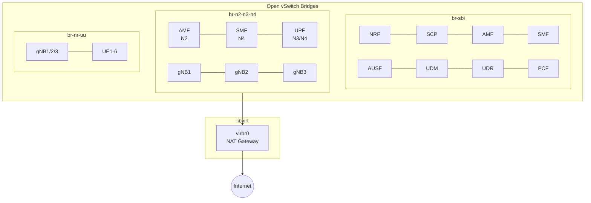

# 5G Network Topology

## Overview

This document describes the current 5G SA (Standalone) network topology deployed using ContainerLab with Open5GS core and UERANSIM RAN simulator.

## High-Level Architecture



## RAN Topology Detail



## Data Plane Flow



## Control Plane Flow



## Network Bridges



## Network Components

### 5G Core Network Functions (Open5GS)

| NF | Container Name | SBI IP | Description |
|----|---------------|--------|-------------|
| NRF | clab-open5gs-5gc-nrf | 10.254.1.4 | Network Repository Function |
| SCP | clab-open5gs-5gc-scp | 10.254.1.7 | Service Communication Proxy |
| AMF | clab-open5gs-5gc-amf | 10.254.1.1 | Access and Mobility Management |
| SMF | clab-open5gs-5gc-smf | 10.254.1.8 | Session Management Function |
| UPF | clab-open5gs-5gc-upf | 10.100.1.3 | User Plane Function |
| AUSF | clab-open5gs-5gc-ausf | 10.254.1.2 | Authentication Server Function |
| UDM | clab-open5gs-5gc-udm | 10.254.1.9 | Unified Data Management |
| UDR | clab-open5gs-5gc-udr | 10.254.1.10 | Unified Data Repository |
| PCF | clab-open5gs-5gc-pcf | 10.254.1.6 | Policy Control Function |
| NSSF | clab-open5gs-5gc-nssf | 10.254.1.5 | Network Slice Selection Function |
| BSF | clab-open5gs-5gc-bsf | 10.254.1.3 | Binding Support Function |
| MongoDB | clab-open5gs-5gc-mongodb | 10.254.1.100 | Subscriber Database |
| WebUI | clab-open5gs-5gc-webui | 10.254.1.200 | Management Interface |

### gNodeBs (UERANSIM)

| gNodeB | Container | NR Cell ID | N2/N3 IP | NR-Uu IP | Serving UEs |
|--------|-----------|------------|----------|----------|-------------|
| gNB1 | clab-ueransim-gnb | 0x000000001 | 10.100.1.4 | 10.1.1.10 | UE1, UE2 |
| gNB2 | clab-ueransim-gnb2 | 0x000000002 | 10.100.1.5 | 10.1.1.11 | UE3, UE4 |
| gNB3 | clab-ueransim-gnb3 | 0x000000003 | 10.100.1.6 | 10.1.1.12 | UE5, UE6 |

### User Equipment (UERANSIM)

| UE | Container | IMSI | NR-Uu IP | Serving gNB | PDU Session |
|----|-----------|------|----------|-------------|-------------|
| UE1 | clab-ueransim-ue1 | 001010000000001 | 10.1.1.21 | gNB1 | 172.45.1.x |
| UE2 | clab-ueransim-ue2 | 001010000000002 | 10.1.1.22 | gNB1 | 172.45.1.x |
| UE3 | clab-ueransim-ue3 | 001010000000003 | 10.1.1.23 | gNB2 | 172.45.1.x |
| UE4 | clab-ueransim-ue4 | 001010000000004 | 10.1.1.24 | gNB2 | 172.45.1.x |
| UE5 | clab-ueransim-ue5 | 001010000000005 | 10.1.1.25 | gNB3 | 172.45.1.x |
| UE6 | clab-ueransim-ue6 | 001010000000006 | 10.1.1.26 | gNB3 | 172.45.1.x |

## PLMN Configuration

| Parameter | Value |
|-----------|-------|
| MCC | 001 |
| MNC | 01 |
| TAC | 1 |
| S-NSSAI SST | 1 |
| APN/DNN | internet |

## Subscriber Security

| Parameter | Value |
|-----------|-------|
| K | 465B5CE8B199B49FAA5F0A2EE238A6BC |
| OPc | E8ED289DEBA952E4283B54E88E6183CA |
| AMF | 8000 |

## WebUI Access

- **URL**: http://34.34.219.137/
- **Username**: admin
- **Password**: 1423

## Useful Commands

```bash
# Check all containers
sudo docker ps

# View gNB logs
sudo docker exec clab-ueransim-gnb cat /var/log/gnb.log

# View UE logs  
sudo docker exec clab-ueransim-ue1 cat /var/log/ue.log

# Check UE PDU session
sudo docker exec clab-ueransim-ue1 ip addr show uesimtun0

# Test connectivity from UE
sudo docker exec clab-ueransim-ue1 ping -I uesimtun0 8.8.8.8

# Check AMF registered gNBs
sudo docker exec clab-open5gs-5gc-amf cat /var/log/open5gs/amf.log | grep "Number of gNBs"

# List subscribers
sudo docker exec clab-open5gs-5gc-mongodb mongosh --quiet --eval \
  'db.getSiblingDB("open5gs").subscribers.find({}, {imsi: 1})'
```

## File Locations

| File | Path |
|------|------|
| Open5GS Topology | `containerlab/5g-sa_open5gs_ueransim/topologies/open5gs-5gc.yaml` |
| UERANSIM Topology | `containerlab/5g-sa_open5gs_ueransim/topologies/ueransim.yaml` |
| gNB Configs | `containerlab/5g-sa_open5gs_ueransim/conf/ueransim/gnb*.yaml` |
| UE Configs | `containerlab/5g-sa_open5gs_ueransim/conf/ueransim/ue*.yaml` |
| Open5GS Configs | `containerlab/5g-sa_open5gs_ueransim/conf/open5gs/*.yaml` |
